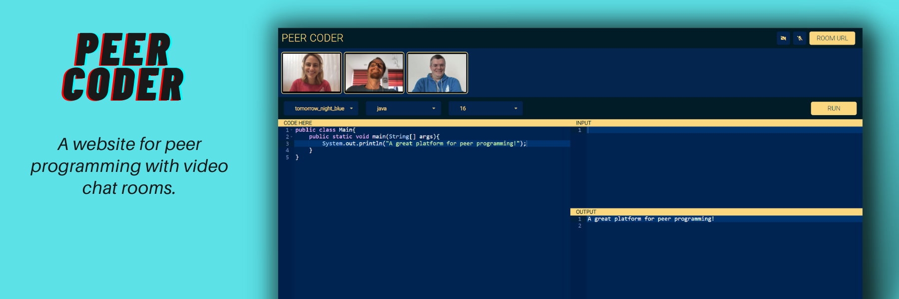

# PEER CODER ⭐

[](https://reactjs.org/)
[](https://shreyshreyansh.github.io/Peer-Coder-Web/)


## Overview 👀


- **Real time code syncing among peers 👨‍💻**
- **Executes code in Java, Python, C++, C 💻**
- **Real time video and audio call 📹**
- **Clean UI ⚡**

## What is Peer Coder? 🤔

#### Remote pair programming is something developers have grappled with since well before the pandemic began. 
#### Peer Coder is ideal for Online Interviewing of Developers as well as Learning to code from Friends.
#### An online code editor for interviews, troubleshooting, teaching & more…

## Dependencies 🗃

- [React.js](https://reactjs.org/) - **Frontend Framework**
- [Node.js](https://nodejs.org/en/) - **Backend Framework**
- [Socket.io](https://socket.io/) - **Client-Server Communication**
- [Peer.js](https://peerjs.com/) - **Client-Client Communication**
- [Ace editor](https://www.npmjs.com/package/react-ace) - **Code Editor**

## Run Locally 💻

```
> Clone the repo
    >> For Windows: Git Bash
    >> For Linux: Terminal
    >> git clone https://github.com/shreyshreyansh/Peer-Coder.git
    >> cd Peer-Coder
> Install all dependencies
    >> npm i
> Spin the server on port 4000
    >> cd backend
    >> npm start
> Spin the react on port 3000
    >> cd frontend
    >> npm start
> Start the server
    >> npm start
```

[](https://github.com/shreyshreyansh/Peer-Coder)
